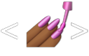

<link rel="stylesheet" href="https://cdn.jsdelivr.net/gh/devicons/devicon@latest/devicon.min.css">

# DigiCore

## The project was built with responsive design using the following technologies:

<table align="center">
    <tr>
        <td align="center" width="150" height="130">
            
            <br>Next.js
        </td>
        <td align="center" width="150" height="130">
            
        <br>TypeScript
        </td>
        <td align="center" width="150" height="130">
            
        <br>Ant Design
        </td>
        <td align="center" width="150" height="130">
            
        <br>Emotion
        </td>
        <td align="center" width="200">
            
        <br>Styled Components
        </td>
    </tr>
</table>

## Start

1. Clone
```sh
   git clone https://github.com/Maryna-Serhiichuk/digi-core.git
```

2. Go to folder
```sh
   cd frontend
```

3. Start dev mode
```sh
   yarn dev
```

4. Open
```sh
   http://localhost:3000
```
