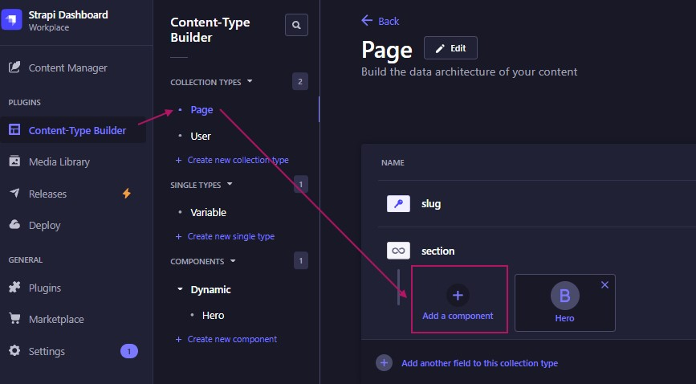
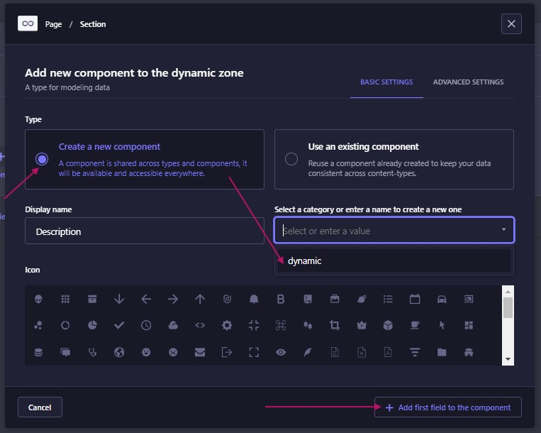
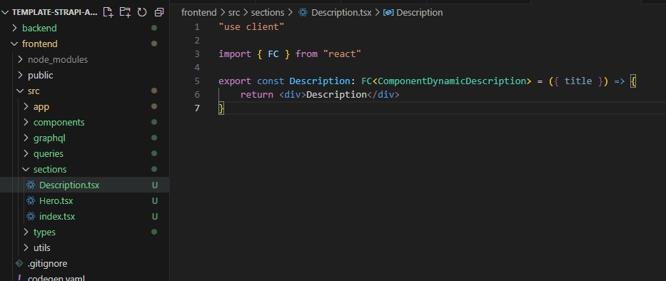

# Start and Generation of Dynamic Sections

This project enables dynamic section creation using Strapi and a content generator.

## Getting Started

### Installing Dependencies
Before running the project, install the dependencies:
```sh
cd backend && yarn install
cd ../frontend && yarn install
```

### Starting the Servers

1. Start the backend:
   ```sh
   cd backend && yarn develop
   ```
2. Start the generator:
   ```sh
   cd generator && node start
   ```

## Creating a New Section

1. In Strapi, create a new section in Dynamic Components.


2. Add this section to the `section` selector in the Page object.


3. Run the generator to update the sections:
   ```sh
   cd generator && node generate
   ```

## Result
